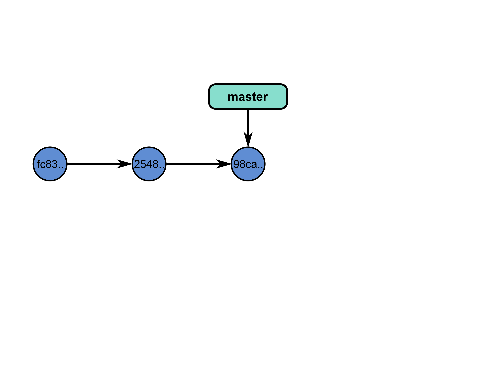
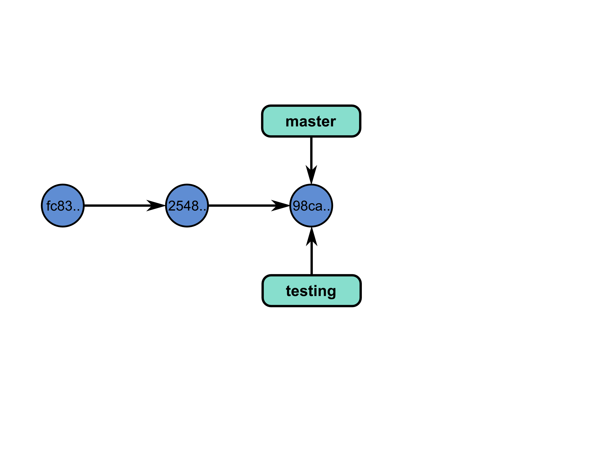
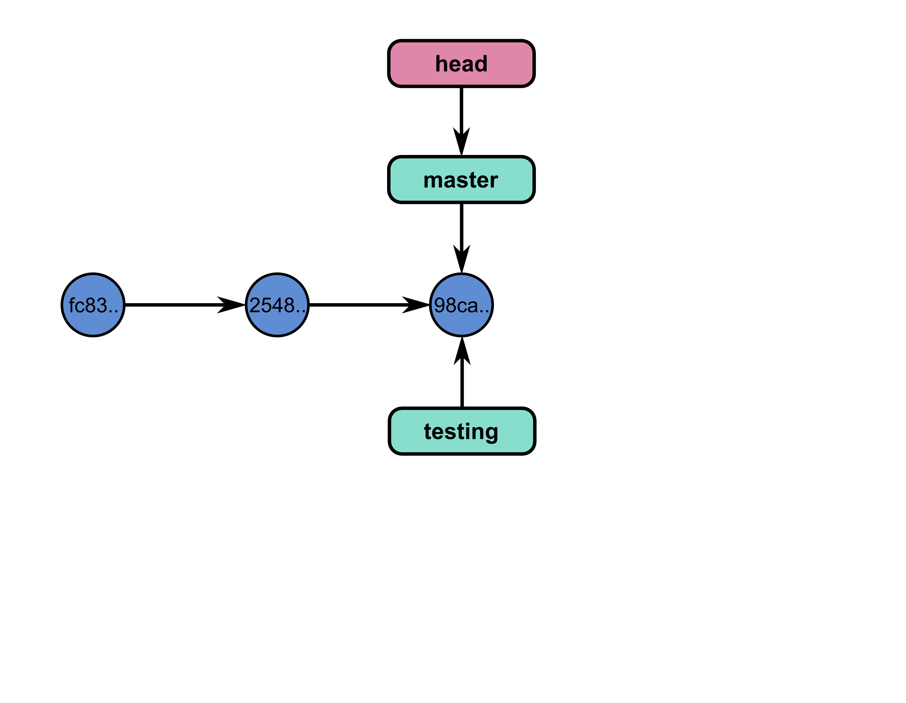
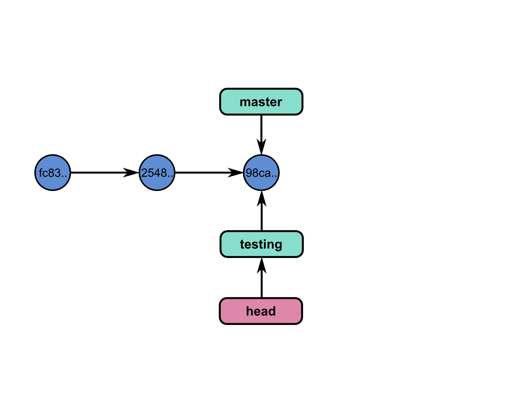
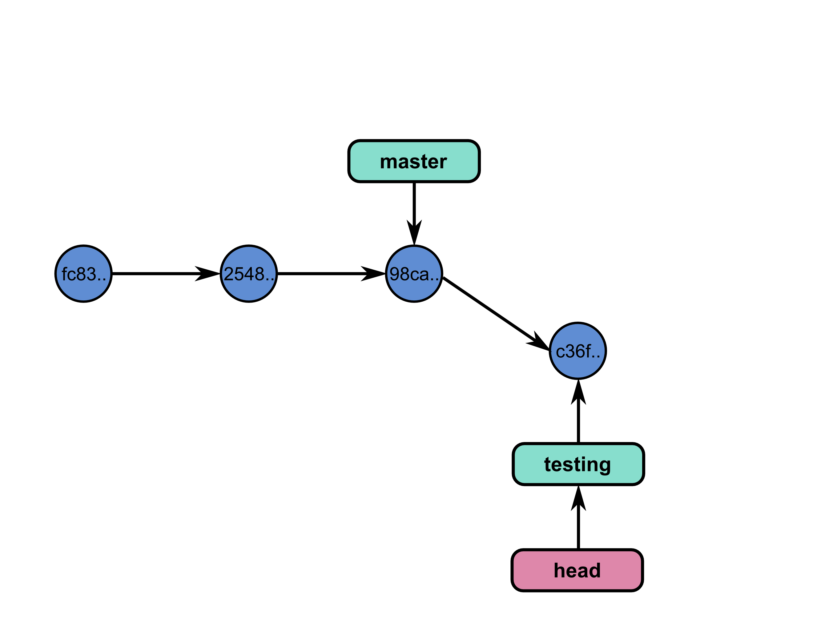
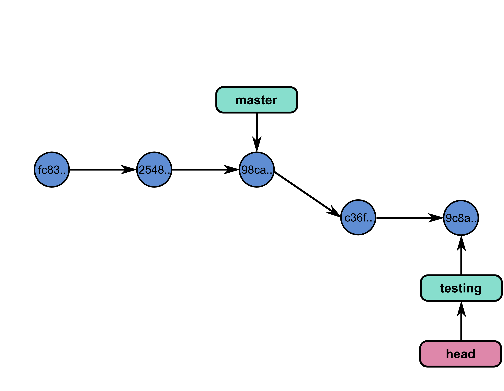
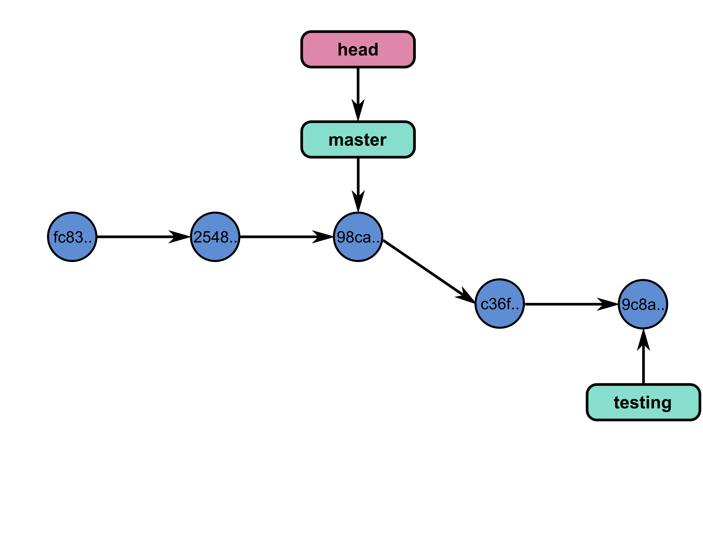
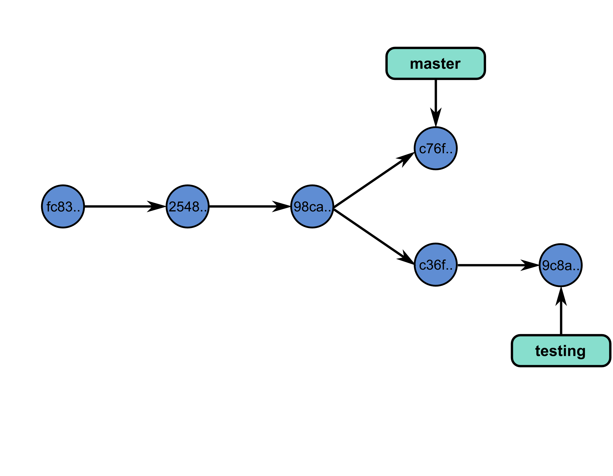

# 1.0 A quick review of git basics:

Covered commands:

* `git config`
* creating a repository with `git init` or `git clone`
* `git clone`
* `git init`
* `git add`
* `git commit`
* `git status`
* `git log`
* `git checkout`

#### Setting up git

We want git to record changes with authorship, so it's clear who changed what
and when that happened. There are many options that we can set with `git
config`, but today we'll refresh the basics

Identity:
```
git config --global user.name "Your Name"
git config --global user.email "youremail@domain.com"
```

Preferred Text Editor (used by git to modify commit messages, among other
things):
```
git config --global core.editor "atom --wait"
```
For today, we'll be using atom. But in the future you can look up how to set
your preferred editor
[here](http://swcarpentry.github.io/git-novice/02-setup/index.html)

In the case of atom or any other graphical user text editor we need to set the
editor to wait (with --wait or -w) to make sure that git waits until the file is
saved and closed to finish commiting the file.

An aside: we can change git settings for repositories only, or for the entire
system. This is up to your preference, but perhaps you have a project associated
with a lab and want to change your user e-mail only for that particular project.
You'd change the `user.email` option in the repository rather than for your
whole user space. Changing config options is up to your use and needs.   

* locally with `git config [options]` or `git config --local [options]`. The
config options are stored in `$REPOPATH/.git/config`. Your current working
directory will need to be a a working git repository in order to set config
options at this level.
* globally (for a particular user) with `git config --global [options]`. The
config options are stored in `~/.gitconfig`
  * for windows: `C:\Users\username`
  * for apple: `/Users/username`
  * for linux: `/home/username`
* system-wide with `git config --system [options]`

tips:
- if you change your user config settings to and e-mail not associated with your
remote (like github), you might have some issues pushing.
- you can modify your config on the command line or by editing the config files
mentioned above.
- you can check your config settings by opening the config file or by executing
`git config --list` or `git config -l`

#### Creating a repository

* To initialize a new repository from the command line: `git init` (this option
doesn't require internet access or a github account)
* We can also get an existing repository from a remote server with `git clone
https://github.com/username/reponame.git`. This command will create a
new folder
called **reponame** in your current working directory and will copy
the contents
of the remote repository into that folder. (this option requires internet, and
depending on permissions you may need a github account)

We can check that a folder we're in is a git repository by executing `git
status`. If the folder isn't a repository, git will tell us `fatal: Not a git
repository (or any of the parent directories): .git`. We can also check by
listing all files and folders (including hidden ones) in our directory with `ls
-a`. A git repository will have a **.git/** folder that contains the history of
our repository.

tips:
- each repository should be in its own folder, not in a subdirectory of another
version-controlled folder
- every time you work on a project on a new computer you'll need to update your
git config settings to ensure you have proper credit for the things you author
- if you have different config settings locally vs. globally the more refined
config settings will override something more global. In that vein, local >
global > system.

#### Tracking Changes

If you haven't yet, make a new project folder, navigate into it and then
initialize the repository.
```
$ mdkir dissertation
$ cd dissertation
$ git init
Initialized empty Git repository in /Users/madicken/repos/dissertation/.git/
```

Our most used commands in git will be the following:
* `git add` will add a file to the staging area
* `git commit` will save or commit our staged files to
* `git status` will return information about the existing state of our
repository.
* `git log` will show the commit log

Now that we've initialized an empty repository in `/dissertation/`, we can
check the status:

```
$ git status
On branch master

No commits yet

nothing to commit (create/copy files and use "git add" to track)
```

A file in a git repository can be in one of four states: *untracked*,
*unmodified*, *modified*, and *staged*. When we go through the process of
editing a file, adding it, and committing it, we're cycling through these
different states. The figure below from the git book shows this process visually.


These states are reflected when we use `git status` to look at
the status of a directory. Let's create go through this process with regular
`git status` checks and see what this looks like.

```
$ vi AUTHORS.md
$ git status
On branch master

No commits yet

Untracked files:
  (use "git add <file>..." to include in what will be committed)

	AUTHORS.md

nothing added to commit but untracked files present (use "git add" to track)
$ git add AUTHORS.md
$ git status
On branch master

No commits yet

Changes to be committed:
  (use "git rm --cached <file>..." to unstage)

	new file:   AUTHORS.md
$ git commit -m 'add my name to author list'
[master (root-commit) 96c67ed] adding my name to author list
  1 file changed, 1 insertion(+)
  create mode 100644 AUTHORS.md
$ git status
On branch master
nothing to commit, working tree clean
```

Here we've seen AUTHORS.md go from
untracked -> modified -> staged -> unmodified. We can check the log
to see what our history looks like.

```
$ git log
commit 96c67ed10232a25c6d8a1e6eb64e0c25b54d7e34 (HEAD -> master)
Author: Madicken Munk <madicken.munk@gmail.com>
Date:   Mon Jan 14 16:53:20 2019 -0600

    add my name to author list
```

The series of numbers and letters in the first line after the command is what is
known as the *commit hash*:a unique identifier that is used to mark this
particular snapshot of our repository. Note that this is the same identifier
that git returned to us when we committed our changes, but only the first seven
characters were shown.

If we choose to commit with `git commit` and no arguments, git will enter into a
text editor. This is useful if we have a large set of changes that we want to
describe more fully. The first, short commit message should be the TL;DR of our
changes, while the longer detailed message might list specifics.

```
short, descriptive message for my dev work

Here I describe in detail a little more about the dev work that I
did. Maybe I added a few new functions. I could list them here. Of
course, since I'm only editing my dissertation this longer form of
the commit message might not be as relevant to my work.

# Please enter the commit message for your changes. Lines starting
# with '#' will be ignored, and an empty message aborts the commit.
#
# On branch master
# Changes to be committed:
#       modified:   AUTHORS.md
#
```

When we save and exit the editor after writing out our commit message this way,
git will return a similar message as before.

```
$ git commit
[master 2d701bb] add my name to author list
 1 file changed, 1 insertions(+)
```

Tips:
- when committing I personally like to use the shorthand `git commit -m
"This is my message"`, but you can be more verbose with `git commit --message`
or enter
straight into a your preferred text editor with `git commit`. You might prefer
to go into the text editor if you have a lot of changes to describe.
- any of the git commands can be followed a `--help` or `-h` option to learn
more about what options are available to you
- If you're working with changes in many files, you can add all updated files to
the staging area with `git add -u` and all files to the staging area with `git
add -a`

#### Exploring History

The log will tell us about the history of the branches that we're on. I'm going
to step out of the toy repository we've been working in to something a bit more
complex to demonstrate the power of `git log` and its ability to tell us about
our history.

A standard execution of `git log` will show us as much of the log that will fit
into our shell's buffer at a time. At the bottom of the buffer you should see
a `:`.
This is the shell prompting you for navigation. You can page up or down within
the log, or you can exit by pressing you `Q` key. Some of the log messages that
were in the buffer may be printed in the shell when you exit.

Maybe we're only interested in the last few log messages. We can print only a
designated number with `git log -n [number]`. Here I am printing the three most
recent commit messages on matplotlib's master branch:

```
~/repos/matplotlib(master) $ git log -n 2 --sparse
commit a552780fa074feaa54750a9dbe935392f24f6576 (HEAD -> master, origin/master, origin/HEAD)
Merge: a728b91c9 4ef57532d
Author: Nelle Varoquaux <nelle.varoquaux@gmail.com>
Date:   Mon Jan 14 13:21:39 2019 -0800

    Merge pull request #13107 from anntzer/bboxbase

    Cleanup BboxBase docstrings.

commit a728b91c958f53eae1e41d38b2b6006f54666bcf
Merge: 2502fe6f0 2585d9fe2
Author: Nelle Varoquaux <nelle.varoquaux@gmail.com>
Date:   Mon Jan 14 13:20:18 2019 -0800

    Merge pull request #13108 from anntzer/capitalize-docstrings

    Capitalize some docstrings.
```

Sometimes we don't need the entire log message printed out in such a detailed
format. We can get a condensed version of the log with the `--oneline` flag.
Here's an example printing the last 10 log messages from matplotlib's master
branch:

```
~/repos/matplotlib(master) $ git log -n 10 --oneline
a552780fa (HEAD -> master, origin/master, origin/HEAD) Merge pull request #13107 from anntzer/bboxbase
a728b91c9 Merge pull request #13108 from anntzer/capitalize-docstrings
2502fe6f0 Merge pull request #13115 from timhoffm/check-sphinx_copybutton
46350268f Merge pull request #13151 from timhoffm/doc-radiobutton
57d031d23 Merge pull request #13178 from anntzer/derole
beed2d80e Merge pull request #13089 from anntzer/quivermatrix
aef686b43 Merge pull request #13179 from anntzer/axis_artist-deprecated
d9d3bdb49 Avoid calling a deprecated API in axis_artist.
bacea6a99 Remove :func: markup from mlab docstrings.
6b3c015da Merge pull request #13047 from timhoffm/doc-contourf-extend-cmap
```

We can return to previous states in our repository with the commit hashes that
are listed in the log. We can navigate in our history and see previous versions
of our repository. To do this, we can use `git checkout <commit ID>`, which will
move HEAD, a pointer to the tip of master (this was shown to us in the log as
`HEAD -> master`, to the commit ID of our choice). I'll go back a few commits to
`57d031d23`:

```
$ git checkout 57d031d23
Note: checking out '57d031d23'.

You are in 'detached HEAD' state. You can look around, make experimental
changes and commit them, and you can discard any commits you make in this
state without impacting any branches by performing another checkout.

If you want to create a new branch to retain commits you create, you may
do so (now or later) by using -b with the checkout command again. Example:

  git checkout -b <new-branch-name>

HEAD is now at 57d031d23... Merge pull request #13178 from anntzer/derole
$ git status
HEAD detached at 57d031d23
nothing to commit, working tree clean
```

With HEAD pointing to a commit farther back than the tip of master, we are in
`Detached HEAD` state. This means we're pointing to a specific commit rather
than the tip of the branch. Performing a `git log` here shows us all commits
previous to `57d031d23`, but none of the commits going forward.

```
$ git log -n 10 --oneline
57d031d23 (HEAD) Merge pull request #13178 from anntzer/derole
beed2d80e Merge pull request #13089 from anntzer/quivermatrix
aef686b43 Merge pull request #13179 from anntzer/axis_artist-deprecated
d9d3bdb49 Avoid calling a deprecated API in axis_artist.
bacea6a99 Remove :func: markup from mlab docstrings.
6b3c015da Merge pull request #13047 from timhoffm/doc-contourf-extend-cmap
d12be5098 Enable local doc building without git installation (#13015)
e1750a8e8 Don't try to find TeX-only fonts when layouting TeX text. (#13170)
a5988114c Merge pull request #12957 from Milania1/win-user-fonts
4cdd07189 Merge pull request #12951 from anntzer/get_layout
```

In this state we can look around, but we shouldn't make changes. If we do, our
changes going forward from `57d031d23` will not be associated with a branch, and
we won't be able to navigate back to them easily. To go back to our most recent
commit, we can type `git checkout master`, which will return us to the tip of
our branch, master (more on branching later).  

```
$ git checkout master
Previous HEAD position was 57d031d23... Merge pull request #13178 from anntzer/derole
Switched to branch 'master'
Your branch is up-to-date with 'origin/master'.
$ git log -n 2 --oneline
a552780fa (HEAD -> master, origin/master, origin/HEAD) Merge pull request #13107 from anntzer/bboxbase
a728b91c9 Merge pull request #13108 from anntzer/capitalize-docstrings
```

If you do happen to commit off of a detached head state, this page in the git
book is a useful resource to make references out of these new commits:
https://git-scm.com/docs/git-checkout#_detached_head


#### Ignoring Things

What if you have a series of large data files that you'd like to put into your
repository folder, but version controlling them isn't necessary?
We can *ignore*
files and entire folders from being tracked by git. Let's say I get a data file
called `mydata.h5` and I want to ignore it. This is the series of commands that
I'd execute to make that happen.  

```
$ git status
On branch master
Untracked files:
  (use "git add <file>..." to include in what will be committed)

	mydata.h5

nothing added to commit but untracked files present (use "git add" to track)
$ vi .gitignore
$ cat .gitignore
mydata.h5
$ git status
On branch master
Untracked files:
  (use "git add <file>..." to include in what will be committed)

	.gitignore

nothing added to commit but untracked files present (use "git add" to track)
```

Note that once I've modified my .gitignore to include `mydata.h5` git will no
longer show it as an untracked file. But since I've created a new .gitignore
file that is something that I'll need to add and commit to my repository.

.gitingore files accept directories and wildcards to ignore entire subsets of
files within the subdirectory structure of your repository.

```
$ cat .gitignore
*.zip
build/
mydata.h5
```

This particular .gitignore file will ignore all files ending in .zip,
everything
in the build folder, and a hdf5 data file called mydata.

# 2.0 Deleting and Canceling

Covered commands:
* `git rm` vs `rm <filename>`+`git add <filename>`
* `git mv` vs `mv <filename> <filename2>`+`git add <filename> <filename2>`
* `git diff`
* `git reset HEAD <filename>`
* `git checkout -- <filename>`


In the last section we modified our .gitignore file to ignore hdf5 files. Let's add it to the staging area.

```
$ git add .gitignore
$ git status
On branch master
Changes to be committed:
  (use "git reset HEAD <file>..." to unstage)

	modified:   .gitignore
```

Actually, it might be more relevant for us to ignore all of our h5 files, rather than by a name specifically. We can unstage the file and modify it.

```
$ git reset HEAD .gitignore
Unstaged changes after reset:
M	.gitignore
$ vi .gitignore
$ git status
$ git status
On branch master
Changes not staged for commit:
  (use "git add <file>..." to update what will be committed)
  (use "git checkout -- <file>..." to discard changes in working directory)

	modified:   .gitignore

no changes added to commit (use "git add" and/or "git commit -a")
```

If we concatenate the file, we can see that we've modified our file as expected.

```
$ cat .gitignore
*.h5
```

To unstage the file, we've used `git reset HEAD <filename>`. Earlier in history, we talked about HEAD pointing to a specific commit. This specific usage of HEAD with `git reset` unstages files. If we use a variant of git reset and use `git reset HEAD~2 <filename>`, git will get the version of filename in two commits previously and put it in the staging area. git reset will always affect the staging area of your repository.

We can also completely remove changes we've made in the working directory with `git checkout -- <file>`. This will return us to the version of the file at our last commit. However, this is slightly dangerous because you will completely lose the changes you've made. If you want to save your changes for later, you can see some of the extras at the end of the lesson using `git stash`.

`git diff`, like its sister command diff, will compare different files or
versions of a file. On its own `git diff` will tell us the difference in our working directory that we haven't yet staged for commit. We can also compare arbitray versions of the file using commit hashes or branch names.

Now that we have unstaged .gitignore, we can use `git diff`

```
$ git diff .gitignore
diff --git a/.gitignore b/.gitignore
index 511561c..79df784 100644
--- a/.gitignore
+++ b/.gitignore
@@ -1 +1 @@
-mydata.h5
+*h5
```

Sometimes we need to delete files out of our repository, rename them, or move
them in and out of the staging area. git has commands to help us do this. We
don't *have to* use these commands, but unstaging them if we decide we want to
go back is much easier using them.

`git rm <filename>` will remove the file completely from the working directory and show that it has been deleted

```
$ git rm AUTHORS.md
$ git status
On branch master
Changes to be committed:
 (use "git reset HEAD <file>..." to unstage)

 deleted:    AUTHORS.md

```

this looks different than if we just remove the file. First let's go back to our old copy of AUTHORS.md
```
$ git checkout HEAD AUTHORS.md
```
and now try to delete it the normal way.
```
$ rm AUTHORS.md
$ git status
On branch master
Changes not staged for commit:
  (use "git add/rm <file>..." to update what will be committed)
  (use "git checkout -- <file>..." to discard changes in working directory)

	deleted:    AUTHORS.md

no changes added to commit (use "git add" and/or "git commit -a")
```
in order to commit this change, we'd also need to do `git add AUTHORS.md` to put our deleted file into the staging area. `git rm` makes this process more convenient.

Similarly, we can move files with `git mv <oldname> <newname>`, which renames oldname to newname, and then adds oldname and newname to staging.

```
$ git mv AUTHORS.md contributors.md
$ git status
On branch master
Changes to be committed:
  (use "git reset HEAD <file>..." to unstage)

	renamed:    AUTHORS.md -> contributors.md
```

tips:
* just like diff, git has a special `git grep` command that only greps files
tracked in the git repository. This is especially nice to use if you have large
data files in your directory but they aren't version controlled by git.
* git helps save us from ourselves. Without using version control, rm would
make us lose a file forever. Thanks to version control we can restore it.

# 3.0 Branching

Covered commands + concepts:
* `git branch`
* `git checkout`

Branching is a way for us to work on different features in an isolated environment.

As we've talked about in this lesson, commits are repository snapshots.


A branch is a pointer to a commit (the most recent commit in the branch history).


We can have multiple branches.


And we know which branch we're in with HEAD.


We can switch branches.


And we can commit in a branch, which will update both the branch and the HEAD pointer.


We can commit again.


And then we can switch branches.


# 4.0 Merging

Covered commands + concepts:

* `git merge [branchname]`
* merging vs. rebasing

Git merge is a powerful tool in our git arsenal. We use git merge to
incorporate the changes in one branch to another. A bit later we'll go over
merging things other than local branches.

Let's say we have the same two branches that have been worked on as shown
previously. We're on the branch master:


and we can merge testing into it:


From there, we can continue working. All commits in this diagram will show up
in our history with git log.


A quick aside on rebasing:

Some projects prefer to use a rebase-based method for development.

# 5.0 Conflicts  

Sometimes we can't automatically merge a branch into its desired destination.
git is smart, but sometimes it's much more obvious to a human what should
be removed in a conflict.
When that happens git will notify us that we have to do a merge conflict
resolution.  

In `AUTHORS.md` I've added some descriptions of my dissertation committee
members on a branch called `authors` but on the `master` branch I've added their
actual names. When I try to merge, git notifies me of the issue:

```
$ git branch
  master
* authors
$ git merge master
Auto-merging AUTHORS.md
CONFLICT (content): Merge conflict in AUTHORS.md
Recorded preimage for 'AUTHORS.md'
Automatic merge failed; fix conflicts and then commit the result.
```

If I open `AUTHORS.md`, we can see that git has modified the file to
include the
changes from both branches. By navigating to the segment between where git has
added `<<<<<<< HEAD` and `>>>>>>> branchname` you can see what the conflicts
are. Now I need to choose which changes I want to
incorporate for this merge.

```
<<<<<<< HEAD
My committee has the following people
* My national lab colleague
* Another professor in my research area
* The guy who wrote the spherical cow book
=======
My committee members are:
* Dr. T
* Prof. M
* Prof. J
>>>>>>> master
```

To do this, I need to delete everything out of the file except what I want to
keep. My process looks like this:

```
$ vi AUTHORS.md
$ git status
On branch authors
You have unmerged paths.
  (fix conflicts and run "git commit")
  (use "git merge --abort" to abort the merge)

Unmerged paths:
  (use "git add <file>..." to mark resolution)

	both modified:   AUTHORS.md

no changes added to commit (use "git add" and/or "git commit -a")
$ git add AUTHORS.md
$ git status
On branch merge-branch
All conflicts fixed but you are still merging.
  (use "git commit" to conclude merge)

Changes to be committed:

	modified:   AUTHORS.md
$ git commit -m 'merge master into authors'
Recorded resolution for 'AUTHORS.md'.
[authors 0d253a2] merge master
```

Note that the prompt here that git shows is is very similar to that of a
standard file modification, but we see some additional wording, like
> You have unmerged paths.
> All conflicts fixed but you are still merging.

Remember that git always tries to be helpful, so reading what's returned
by `git status` can be useful to us figuring out what to do.

tips:
* you can always abort a merge if you realize you're not ready with `git merge
--abort`.
* short lines make merge conflicts much easier. If you don't have hard wrapping
set in your text editor, you may have a merge conflict that looks like an
entire paragraph.


# Interlude: local vs. remote git

Up until this point, we've done exclusively command-line git. All of this has
been on our *local machine*. We could be version-controlling our work and no
person in the world could access it. Local version control is still helpful! We
can go back to previous states and manage our own work, but we don't have a
remote backup (unless you're keeping your git repository in a google drive
folder or something, but that's unnecessary). Local git is great because you
don't need internet access. You don't need a github account! You just need git
and your computer.

Using git + a remote backup allows us broader options than version controlling
our work on our local computer. We have a remote backup that will safely store
our work. If our computer gets stolen (or if you're like me and maybe
accidentally spill coffee on your computer), we can re-clone our work and start
right where we left off on a brand new machine!  

There are many remote backups that exist for git. `github`, `gitlab`,
`bitbucket`, or even a local server will allow you to back up your repository.
Each of these options differs slightly. Today I'll be focusing on using github
as a remote system.

Github allows us to not only store remote copies of our work, but also to
collaborate and manage our repository on the web. Earlier we did command-line
based conflict resolutions. Github has tools to do conflict resolutions on their
site, allowing for colleagues that may not be as confident with command-line
based workflows to still contribute to OSS. To use github, and to backup our
repository we need to have an internet connection. We only need the internet
connection when we're directly interacting with our remote -- to continue adding
and committing locally we still don't require an internet connection. But to
re-sync local changes up to github we'll need that connection. As we move into
the next section I'll be showing how our local and remote git histories change
as we make changes in our repository.

Consistently pushing our commits to github has an additional bonus: no matter
how much we might mess up our local working copy, we can always get a fresh
clone from github.

# 6.0 Remotes

Covered commands + concepts:
* `git remote add [name] [url]`
* `git pull`
* `git push`
* `git fetch` and `git merge`

When we use git in conjunction with remotes, we use a few more commands. `git remote` will list all of our remotes by name. If we want to know a bit more about them (like what URL each is associated with), we can use `git remote -v`.  

# 7.0 Collaboration

* forking
* pull requests
* issues
* comparing changes
* `git fetch` and `git merge` with multiple remotes
* tagging issues in PRs

Often we will have changes on our remote that aren't on our local machine yet. There are a few ways we can get these changes pulled into our local machine effectively. First, `git fetch` will copy the remote changes into our git folder. `git fetch` on its own will copy all of the remote branches and stores them as remote tracking branches. We can see them with `git branch -a`. As an example, I'm going to fetch a repository I haven't updated in a few days. I have my fork, `origin`, and I have the upstream package that I forked that I named `upstream`. First I'll fetch upstream:

```
$ git fetch upstream
remote: Enumerating objects: 32, done.
remote: Counting objects: 100% (27/27), done.
remote: Compressing objects: 100% (10/10), done.
remote: Total 16 (delta 12), reused 8 (delta 6), pack-reused 0
Unpacking objects: 100% (16/16), done.
From https://github.com/yt-project/yt
   2fa8519dd..29005b829  master     -> upstream/master
```

We can see the commit references between master and upstream/master as `2fa8519dd..29005b829`. We can look at all the commits between master and upstream/master with the log:

```
$ git log --oneline master..upstream/master
29005b829 (upstream/master) Merge pull request #2133 from brittonsmith/np16
9c38681a8 Provide list type to np.column_strack to fix numpy 1.16 future warning.
b63f72f13 Merge pull request #2132 from neutrinoceros/doc_dev_conda
1b944e26b Add documentation on how to install the dev version of yt within anaconda and without using pip
2fa8519dd Merge pull request #2122 from chummels/shea_fix
6b096c0e7 Simplifying logic with np.asanyarray()
2efd85bd4 Adding test for annotation of YTArray not in code_units.
07e0b6c0f Making sanitize_coords handle both YTArrays and numpy arrays.
e1765465b Making PlotCallback methods private.
6e595e992 Merge pull request #2128 from cphyc/fix/sphere_unit_mistake
d8bc026f0 Convert radius in right unit
dfa4a9e18 Merge pull request #2125 from ngoldbaum/debian-fix
6649bc658 run tests in temporary directory. fixes #2123
4530d035a Updating docstrings for annotate_marker and annotate_arrow.
7264d040a Updating callback tests to cover annotate_arrow and annotate_marker with multiple points.
eef928b13 Cleaning up sanitize_coord().
a5e8d92e7 Making annotate_arrow() work with multiple points.
12acb1644 Modifying sanitize_coord_system to handle multiple points.
26c70d1d0 sanitize_coord_system was returning just the first coordinate if coord_system == data; now return the full list
```

We can expand this a bit to see where HEAD is pointed.

```
$ git log --oneline -n 15 upstream/master
29005b829 (upstream/master) Merge pull request #2133 from brittonsmith/np16
9c38681a8 Provide list type to np.column_strack to fix numpy 1.16 future warning.
b63f72f13 Merge pull request #2132 from neutrinoceros/doc_dev_conda
1b944e26b Add documentation on how to install the dev version of yt within anaconda and without using pip
2fa8519dd Merge pull request #2122 from chummels/shea_fix
6b096c0e7 Simplifying logic with np.asanyarray()
2efd85bd4 Adding test for annotation of YTArray not in code_units.
07e0b6c0f Making sanitize_coords handle both YTArrays and numpy arrays.
e1765465b Making PlotCallback methods private.
6e595e992 Merge pull request #2128 from cphyc/fix/sphere_unit_mistake
d8bc026f0 Convert radius in right unit
dfa4a9e18 Merge pull request #2125 from ngoldbaum/debian-fix
6649bc658 run tests in temporary directory. fixes #2123
97054577d (HEAD -> master, origin/master, origin/HEAD) Merge pull request #2124 from zingale/master
4efd4b2ea update the docs to reflect the fact that rays are not ordered.
```

You can see the commit IDs in this log between master and upstream/master reflect those that were returned with the fetch command. We can also see that my fork, origin/master is at the same point as my local copy of master. Let's merge upstream/master into master and see how the log changes.

```
$ git merge upstream/master
Updating 97054577d..29005b829
Fast-forward
 .travis.yml                                           |   1 +
 doc/source/installing.rst                             |  11 ++++--
 yt/frontends/gadget/tests/test_outputs.py             |   6 +++
 yt/frontends/stream/io.py                             |   4 +-
 yt/visualization/plot_modifications.py                | 108 +++++++++++++++++++++++++++++++----------------------
 yt/visualization/tests/test_callbacks.py              |  13 +++++++
 yt/visualization/volume_rendering/tests/test_scene.py |   6 ++-
 7 files changed, 99 insertions(+), 50 deletions(-)
$ git log --oneline -n 15 upstream/master
29005b829 (HEAD -> master, upstream/master) Merge pull request #2133 from brittonsmith/np16
9c38681a8 Provide list type to np.column_strack to fix numpy 1.16 future warning.
b63f72f13 Merge pull request #2132 from neutrinoceros/doc_dev_conda
1b944e26b Add documentation on how to install the dev version of yt within anaconda and without using pip
2fa8519dd Merge pull request #2122 from chummels/shea_fix
6b096c0e7 Simplifying logic with np.asanyarray()
2efd85bd4 Adding test for annotation of YTArray not in code_units.
07e0b6c0f Making sanitize_coords handle both YTArrays and numpy arrays.
e1765465b Making PlotCallback methods private.
6e595e992 Merge pull request #2128 from cphyc/fix/sphere_unit_mistake
d8bc026f0 Convert radius in right unit
dfa4a9e18 Merge pull request #2125 from ngoldbaum/debian-fix
6649bc658 run tests in temporary directory. fixes #2123
97054577d (origin/master, origin/HEAD) Merge pull request #2124 from zingale/master
4efd4b2ea update the docs to reflect the fact that rays are not ordered.
```

now we can see that my local copy of master is pointed to the same place as upstream/master. We can update my fork with git push:

```
$ git push origin master
Counting objects: 92, done.
Delta compression using up to 4 threads.
Compressing objects: 100% (46/46), done.
Writing objects: 100% (92/92), 12.84 KiB | 4.28 MiB/s, done.
Total 92 (delta 72), reused 61 (delta 46)
remote: Resolving deltas: 100% (72/72), completed with 20 local objects.
To https://github.com/munkm/yt.git
   97054577d..29005b829  master -> master
$ git log --oneline -n 3 upstream/master
29005b829 (HEAD -> master, upstream/master, origin/master, origin/HEAD) Merge pull request #2133 from brittonsmith/np16
9c38681a8 Provide list type to np.column_strack to fix numpy 1.16 future warning.
b63f72f13 Merge pull request #2132 from neutrinoceros/doc_dev_conda
```

Now our local copy, our fork, and our project's repository all have master
pointed to the same commit.  

aside: this is why branching is powerful. If we're working in a branch that's
constantly being updated with remote changes, we'll have to fetch and merge and
potentially perform a lot of conflict resolutions. We don't have to do that if
we're working in a thematic branch.

A fork is a copy of a repository associated with your user account (or another
organization). Earlier in the lesson we were pushing changes up to our
individual github accounts. However, you don't always have git commit rights to
different repositories. We don't want random people going and changing our
research code or our research papers! Forks help us by allowing people to copy
our code and make changes separately, and we can integrate those changes in our
own time.

Earlier we talked about `git fetch` and `get merge`. These two commands together
are `git pull`. A pull request is a request from a user for the a collaborator
or organization to pull (or fetch and merge) their changes into their own
repository. This is the way that we incorporate our work into another repository
without commit rights. Pull requests can also be submitted on a single
repository between two branches.  

Github also has features that allow us to easily compare changes. We can do this on the command line the same way we diff two branches:

Or we can use the github GUI.

tips:
* always pull down fresh changes from master before you branch.
* branching is powerful because you

# 8.0 A few extra git things!

#### Aliases

Sometimes we find ourselves looking up the same git command over and over again
on stackoverflow. We can customize git with aliases, or shortcuts that are
associated with a a particular configured command. For example, I use `git
checkout -b [mynewbranchname]` a lot, so i could alias this with

```
git config --global alias.sprout "checkout -b"
```

If you're prone to typos, it can be helpful to alias those too!

```
git config --global alias.connit "commit"
```

As with other config options, we can check our aliases with
`git config --list`.
If we have a lot of config options, we can further pipe that to filter out only
alias commands with `git config --list | grep alias`

#### Work in progress

What if you're working on something and somebody pushes changes to your project
remote that are important to what you're doing? You could commit with a work in
progress commit, but maybe that's not helpful to you right now. Enter `git
stash`. What stashing does is "stashes" your changes in your repository and
cleans your working area. What this looks like in practice is:

```
$ git status
On branch master
Changes not staged for commit:
  (use "git add <file>..." to update what will be committed)
  (use "git checkout -- <file>..." to discard changes in working directory)

	modified:   cats.md

no changes added to commit (use "git add" and/or "git commit -a")

$ git stash
Saved working directory and index state WIP on master: f7ae976 making notes on cats

$ git status
On branch master
nothing to commit, working tree clean
```

We can unstash our changes

reference: https://git-scm.com/book/en/v2/Git-Tools-Stashing-and-Cleaning

#### Editing a commit

What if you've committed something and realized you've made an error in your
commit? Maybe you misspelled something in the commit message? Maybe you forgot
to add a closing curly brace at the end of a dictionary in your code?
Enter `git commit --amend`

######  Scenario 1: fixing a commit message

Let's say that I accidentally mess up my commit message

```
$ git commit -m 'this commit is missssspelled'
[master c86fefb] this commit is missssspelled
 1 file changed, 1 insertion(+), 1 deletion(-)
```

I can use `git commit --amend` immediately after to pop into most recent commit
message file and edit it. (note: just like with git commit on its own,
this will
pop you into your chosen text editor that you specified at the beginning of the
lesson). After we close out and save, git will tell us about our amended
message.

```
$ git commit --amend
[master 59a2d70] this commit is not misspelled anymore!
 Date: Sun Jan 13 22:48:30 2019 -0600
 1 file changed, 1 insertion(+), 1 deletion(-)
```
*note that the commit hash has changed from **c86fefb** to **59a2d70** in
this example*

######  Scenario 2: Adding additional changes to the most recent commit

Let's say now that I also forgot to add some changes that I wanted to include in
my commit. I can again use `git commit --amend` to update my commit. This is the
process I'd need to follow:
```
$ git add cats.md
$ git commit --amend
[master 4e624b8] this commit is not misspelled anymore!
 Date: Sun Jan 13 22:48:30 2019 -0600
 1 file changed, 2 insertions(+), 2 deletions(-)
```

Again, when I execute the --amend command I am put into my text editor so I
could additionally modify the commit message if necessary.

*note that the commit hash has changed from **59a2d70** to **4e624b8** with this second amend*

Note: because amending a commit changes the hash associated with the commit, if
you've pushed changes up to github already you'll need to *force push* to
"rewrite history".

reference: https://www.atlassian.com/git/tutorials/rewriting-history

#### Adding only part of a file to the staging area

What if you've modified a file in a few locations and realize that part of your
work thematically would be better in a different commit? What if your text
editor deletes whitespaces at the end of lines and you don't want to commit
that? We can interactively add part of the file with `git add --patch
<filename>`

When this command is executed, git go through, chunk by chunk, and ask you if
you'd like to add this file or not to the staging area with: `Stage this hunk
[y,n,q,a,d,/,j,J,g,s,e,?]?`

The options are as follows:
* y stage this hunk for the next commit
* q quit; do not stage this hunk or any of the remaining hunks
* a stage this hunk and all later hunks in the file
* d do not stage this hunk or any of the later hunks in the file
* g select a hunk to go to
/ search for a hunk matching the given regex
* j leave this hunk undecided, see next undecided hunk
* J leave this hunk undecided, see next hunk
* k leave this hunk undecided, see previous undecided hunk
* K leave this hunk undecided, see previous hunk
* s split the current hunk into smaller hunks
* e manually edit the current hunk
* ? print hunk help

When you're finished, you'll see with `git status` that the file is both in the
staging area and not in staging.

```
$ git status
On branch master
Your branch is up-to-date with 'origin/master'.

Changes to be committed:
  (use "git reset HEAD <file>..." to unstage)

	modified:   cats.md

Changes not staged for commit:
  (use "git add <file>..." to update what will be committed)
  (use "git checkout -- <file>..." to discard changes in working directory)

	modified:   cats.md
```

# References:

The following links you may find useful to supplement this lesson. Many were
heavily referenced to construct this lesson as well!

The pro git book:
* https://git-scm.com/book/en/v2

Previous course material:

* http://members.cbio.mines-paristech.fr/~nvaroquaux/teaching/2014-spss/git.html#slide1
* http://git-lectures.github.io/ and https://github.com/NelleV/git-courses
* https://python.g-node.org/python-summerschool-2013/_media/emanuele_olivetti_python_school_2013_git.pdf

Other git lessons:

* http://swcarpentry.github.io/git-novice/
* https://learngitbranching.js.org/
* https://jni.github.io/git-tutorial
